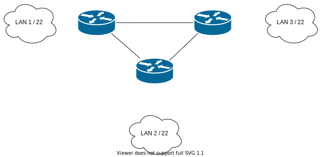

# Zadanie 1

Organizacja planuje rozpoczęcie działalności w 3 budynkach, w każdym z nich przewiduje do 1000 urządzeń IP

1. Zaprojektuj oraz udokumentuj prototyp rozwiązania z wykorzystaniem oprogramowania ``CISCO Packet Tracer``, ``VirtualBox`` lub podobnego. 

## Schemat

## Zawartość

 * Adresy poszczególnych sieci IP
 * Adresację linków pomiędzy routerami
 * Tablice routingów na poszczególnych routerach
 
 
 #Dokumentacja:
 
 ##LAN 1
 
 172.17.156.0/22
 
 255.255.252.0
 
 ###Router 1
 
 ethLan: 172.17.156.1 255.255.252.0
 
 ethR1-R2: 10.10.10.1 255.255.255.252
 
 ethR1-R3: 10.10.10.5 255.255.255.252
 
 ----------Routing table----------
 Dest|gateway
 ----|-------
 172.17.200.0/22|10.10.10.2 
 172.17.12.0/22|10.10.10.6
 
 
 ##LAN 2
 
 172.17.200.0/22
 
 255.255.252.0
 
 ###Router 2
 
 ethLan: 172.17.200.1 255.255.252.0
 
 ethR2-R1: 10.10.10.2 255.255.255.252
 
 ethR2-R3: 10.10.10.9 255.255.255.252
 
 ----------Routing table----------
 
 Dest|gateway
 ----|-------
 172.17.156.0/22|10.10.10.1
 172.17.12.0/22|10.10.10.10
 
 
 
 ##LAN3
 
 172.17.12.0/22 
 
 255.255.252.0
 
 ###Router 3
 
 ethLan: 172.17.12.1 255.255.252.0
 
 ethR3-R1: 10.10.10.6 255.255.255.252
 
 ethR3-R2: 10.10.10.10 255.255.255.252
 
 ----------Routing table----------
 
 Dest|gateway
 ----|-------
 172.17.156.0/22|10.10.10.5
 172.17.200.0/22|10.10.10.9 
 
 
 
 
 
 
 
 
 
 
 
 
 
 
 
 
 
 
 
 
 
 
 
