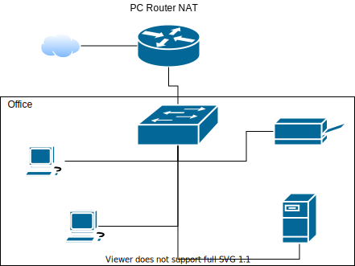

# Zadanie 1

Organizacja planuje ulepszyć działanie istniejącej sieci biurowej.

1. Zaprojektuj oraz udokumentuj konfigurację prototypu rozwiązania z wykorzystaniem oprogramowania ``VirtualBox`` lub podobnego. 

## Schemat

## Wymagania

W sieci pracują komputery biurowe oraz urządzenia siecowe współdzielące zasoby. Do tej pory organizacja borykała się z ręczna konfiguracją urządzeń oraz adresami IP które dla ludzi z poza kadry technicznej były niezrozumiałe. Postanowiono:

* Wykorzystać usługę DHCP do nadawania adresów w sposób automatyczny dla wszystkich stacji roboczych
* Serwer oraz durządzenia IP tj: drukarka muszą posiadać stałe adresy celem zminimalizowanai potrzeby rekonfiguracji ustawiań klientów
* Wprowadzić translację pomiędzy Adresami IP oraz nazwami domenowymi dla kluczowych zasobów
   - erp.mojaorganizacja.pl
   - drukarka.mojaorganizacja.pl
   - router.mojaorganizacja.pl
* Wszystkie urządzenia łączą się z siecią internet z wykorzystaniem bramy NAT
* Wykorzystać podsieć rozmiaru /22 pozwalającej zaadresować co najmniej 600 urządzeń

## Zawartość dokumentacji

 * Charakterystyka rozwiazania 
 * Adresy sieci IP
 * Oprogramowanie wykorzystane do realizacji poszczególnych wymagań
 * Kluczowa konfiguracja oprogramowania pozwalająca na odtworzenie stanu po reinstalacji środowiska
    1. Konfiguracja NAT z iptables 
    2. Konfiguracja DHCP
    3. Konfiguracja DNS
    4. Konfiguracja interfejsów sieciowych
    5. Inne jeżeli wykorzystane
    
 # Dokumentacja
 
 Adres sieci
 
 172.17.200.0/22
 
 255.255.252.0
 
 Adres publiczny 
 
 62.179.4.200
 
 Brama
 
 62.179.4.201
 
 Zakres adresów prywatnych
 
 172.17.200.10 - 172.17.203.254
 
 Adres przypisany do erp.mojaorganizacja.pl - 172.17.200.4
 
 Adres przypisany do drukarka.mojaorganizacja.pl - 172.17.200.3
 
 Adres przypisany do router.mojaorganizacja.pl - 172.17.200.1
 
 
 ## Użyte programy
 
 - dhcp - dodatkowo konfiguracja dhcpd.conf
 - dnsmasq
 - translacja ustawiona w /etc/hosts/
 - ustawiona opcja net.ipv4.up_forward na 1
 - iptables - uruchomione -t nat -A POSTROUTING -o eth0 -j MASQUERADE
 
 
Zrzut ekranu z konfiguracją:

